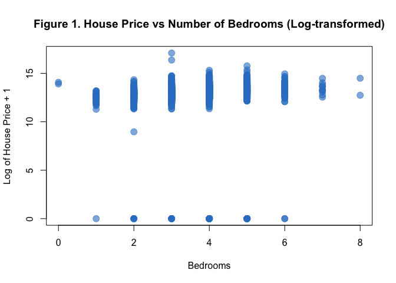

README
================

## Importing the Dataset

``` r
# Define the dataset to download
dataset <- "fratzcan/usa-house-prices"
```

``` r
# Define the URL for the dataset
dataset_url <- "https://www.kaggle.com/api/v1/datasets/download/fratzcan/usa-house-prices"

# Define the destination file path (you can change this)
destination_file <- "usa-house-prices.zip"

# Download the dataset
download.file(dataset_url, destfile = destination_file, mode = "wb")
```

``` r
#Import dataset
housing_data <- read.csv ("USA Housing Dataset.csv", stringsAsFactors = FALSE )
```

## Part 1

### Understanding the Housing Data

**When was the data acquired?**

The data was gathered over the period of time from May 2, 2014 and July
10, 2014. The data was uploaded to Kaggle. The date this data was first
accessed for this analysis was February 12, 2025.

**Where was the data acquired?**

The data consists of housing prices from various cities in Washington,
US. The cities are displayed in a frequency table:

| City               | Frequency |
|:-------------------|----------:|
| Algona             |         1 |
| Auburn             |       162 |
| Beaux Arts Village |         1 |
| Bellevue           |       260 |
| Black Diamond      |         7 |
| Bothell            |        30 |
| Burien             |        64 |
| Carnation          |        18 |
| Clyde Hill         |        10 |
| Covington          |        39 |
| Des Moines         |        52 |
| Duvall             |        39 |
| Enumclaw           |        28 |
| Fall City          |         9 |
| Federal Way        |       131 |
| Issaquah           |       162 |
| Kenmore            |        58 |
| Kent               |       167 |
| Kirkland           |       166 |
| Lake Forest Park   |        33 |
| Maple Valley       |        90 |
| Medina             |        11 |
| Mercer Island      |        81 |
| Milton             |         2 |
| Newcastle          |        31 |
| Normandy Park      |        16 |
| North Bend         |        45 |
| Pacific            |         6 |
| Preston            |         2 |
| Ravensdale         |         4 |
| Redmond            |       209 |
| Renton             |       261 |
| Sammamish          |       158 |
| SeaTac             |        29 |
| Seattle            |      1415 |
| Shoreline          |       112 |
| Skykomish          |         2 |
| Snoqualmie         |        65 |
| Snoqualmie Pass    |         1 |
| Tukwila            |        28 |
| Vashon             |        28 |
| Woodinville        |       103 |
| Yarrow Point       |         4 |

**How was the data acquired?**

The dataset was acquired from Kaggle. Kaggle does not provide any
additional informaation about the source the data was collected from.
There are no links to original publications or projects from which the
dataset was derived.

**What are the attributes of this dataset?**

The dataset contains eighteen different attributes. This section
presents the attributes that appear in the dataset.

First, we specify what each attribute is with descriptions and their
data type (see Table 1). Then, we provide a codebook that specifies a
number with each individual attribute. These numbers will be useful in
determining which attribute is correlated with the summary statistics
displayed in Table 2.

# Part 2

## Summary Statistics

``` r
# Create a summary table, ensuring NAs are handled correctly
summary_table <- data.frame(
  Attribute = colnames(numeric_data),
  Min = sapply(numeric_data, function(x) min(x, na.rm = TRUE)),
  Max = sapply(numeric_data, function(x) max(x, na.rm = TRUE)),
  Mean = sapply(numeric_data, function(x) mean(x, na.rm = TRUE)),
  Median = sapply(numeric_data, function(x) median(x, na.rm = TRUE)),
  SD = sapply(numeric_data, function(x) sd(x, na.rm = TRUE))
)
```

``` r
Attribute <- colnames(housing_data)  # Extract column names
Code <- seq_along(Attribute)  # Create a sequence for the codes

# Create a proper data frame
df <- data.frame(Code, Attribute, stringsAsFactors = FALSE)

# Generate a well-formatted table that links code numbers to each of the attributes in the dataset
df %>% 
  kable(caption = "Attribute Codes for Housing Data", longtable = TRUE) %>%
  kable_styling(latex_options = c("hold_position", "repeat_header")) %>%
  row_spec(0, bold = TRUE) %>%
  column_spec(1, bold = TRUE)
```

<table class="table" style="margin-left: auto; margin-right: auto;">
<caption>
Attribute Codes for Housing Data
</caption>
<thead>
<tr>
<th style="text-align:right;font-weight: bold;">
Code
</th>
<th style="text-align:left;font-weight: bold;">
Attribute
</th>
</tr>
</thead>
<tbody>
<tr>
<td style="text-align:right;font-weight: bold;">
1
</td>
<td style="text-align:left;">
Date
</td>
</tr>
<tr>
<td style="text-align:right;font-weight: bold;">
2
</td>
<td style="text-align:left;">
Price
</td>
</tr>
<tr>
<td style="text-align:right;font-weight: bold;">
3
</td>
<td style="text-align:left;">
Number of Bedrooms
</td>
</tr>
<tr>
<td style="text-align:right;font-weight: bold;">
4
</td>
<td style="text-align:left;">
Number of Bathrooms
</td>
</tr>
<tr>
<td style="text-align:right;font-weight: bold;">
5
</td>
<td style="text-align:left;">
Sqft of Living
</td>
</tr>
<tr>
<td style="text-align:right;font-weight: bold;">
6
</td>
<td style="text-align:left;">
Sqft of Lot
</td>
</tr>
<tr>
<td style="text-align:right;font-weight: bold;">
7
</td>
<td style="text-align:left;">
Number of Floors
</td>
</tr>
<tr>
<td style="text-align:right;font-weight: bold;">
8
</td>
<td style="text-align:left;">
Waterfront
</td>
</tr>
<tr>
<td style="text-align:right;font-weight: bold;">
9
</td>
<td style="text-align:left;">
View
</td>
</tr>
<tr>
<td style="text-align:right;font-weight: bold;">
10
</td>
<td style="text-align:left;">
Condition
</td>
</tr>
<tr>
<td style="text-align:right;font-weight: bold;">
11
</td>
<td style="text-align:left;">
Sqft Above Ground
</td>
</tr>
<tr>
<td style="text-align:right;font-weight: bold;">
12
</td>
<td style="text-align:left;">
Sqft of Basement
</td>
</tr>
<tr>
<td style="text-align:right;font-weight: bold;">
13
</td>
<td style="text-align:left;">
Year Built
</td>
</tr>
<tr>
<td style="text-align:right;font-weight: bold;">
14
</td>
<td style="text-align:left;">
Year Rennovated
</td>
</tr>
<tr>
<td style="text-align:right;font-weight: bold;">
15
</td>
<td style="text-align:left;">
Street
</td>
</tr>
<tr>
<td style="text-align:right;font-weight: bold;">
16
</td>
<td style="text-align:left;">
City
</td>
</tr>
<tr>
<td style="text-align:right;font-weight: bold;">
17
</td>
<td style="text-align:left;">
Zipcode
</td>
</tr>
<tr>
<td style="text-align:right;font-weight: bold;">
18
</td>
<td style="text-align:left;">
Country
</td>
</tr>
</tbody>
</table>

``` r
colnames (housing_data) = Code
housing_data3 = housing_data[-c(1:18)]
housing_data2 = housing_data[-c(1, 15:18)]
bstats = basicStats (housing_data2)[c("Mean", "Stdev", "Median", "Minimum", "Maximum",
"NAs"), ]
```

``` r
summary_long %>%
  kable(caption = "Table 2: Summary Statistics for Housing Data", longtable = TRUE, align = "c") %>%
  kable_styling(latex_options = c("hold_position", "repeat_header")) %>%
  row_spec(0, bold = TRUE) %>%  # Bold column names (first row)
  row_spec(1:nrow(summary_long), font_size = 12) %>%  # Adjust font size for summary rows
  column_spec(1, bold = TRUE)   # Bold the first column (Statistic names)
```

<table class="table" style="margin-left: auto; margin-right: auto;">
<caption>
Table 2: Summary Statistics for Housing Data
</caption>
<thead>
<tr>
<th style="text-align:center;font-weight: bold;">
Statistic
</th>
<th style="text-align:center;font-weight: bold;">
X2
</th>
<th style="text-align:center;font-weight: bold;">
X3
</th>
<th style="text-align:center;font-weight: bold;">
X4
</th>
<th style="text-align:center;font-weight: bold;">
X5
</th>
<th style="text-align:center;font-weight: bold;">
X6
</th>
<th style="text-align:center;font-weight: bold;">
X7
</th>
<th style="text-align:center;font-weight: bold;">
X8
</th>
<th style="text-align:center;font-weight: bold;">
X9
</th>
<th style="text-align:center;font-weight: bold;">
X10
</th>
<th style="text-align:center;font-weight: bold;">
X11
</th>
<th style="text-align:center;font-weight: bold;">
X12
</th>
<th style="text-align:center;font-weight: bold;">
X13
</th>
<th style="text-align:center;font-weight: bold;">
X14
</th>
</tr>
</thead>
<tbody>
<tr>
<td style="text-align:center;font-size: 12px;font-weight: bold;">
Min
</td>
<td style="text-align:center;font-size: 12px;">
0.0
</td>
<td style="text-align:center;font-size: 12px;">
0.00
</td>
<td style="text-align:center;font-size: 12px;">
0.00
</td>
<td style="text-align:center;font-size: 12px;">
0.00
</td>
<td style="text-align:center;font-size: 12px;">
0.00
</td>
<td style="text-align:center;font-size: 12px;">
0.00
</td>
<td style="text-align:center;font-size: 12px;">
0.00
</td>
<td style="text-align:center;font-size: 12px;">
0.00
</td>
<td style="text-align:center;font-size: 12px;">
0.00
</td>
<td style="text-align:center;font-size: 12px;">
0.00
</td>
<td style="text-align:center;font-size: 12px;">
0.00
</td>
<td style="text-align:center;font-size: 12px;">
0.00
</td>
<td style="text-align:center;font-size: 12px;">
0.00
</td>
</tr>
<tr>
<td style="text-align:center;font-size: 12px;font-weight: bold;">
Q1
</td>
<td style="text-align:center;font-size: 12px;">
115000.0
</td>
<td style="text-align:center;font-size: 12px;">
0.23
</td>
<td style="text-align:center;font-size: 12px;">
0.20
</td>
<td style="text-align:center;font-size: 12px;">
516.87
</td>
<td style="text-align:center;font-size: 12px;">
2397.50
</td>
<td style="text-align:center;font-size: 12px;">
0.65
</td>
<td style="text-align:center;font-size: 12px;">
0.00
</td>
<td style="text-align:center;font-size: 12px;">
0.00
</td>
<td style="text-align:center;font-size: 12px;">
0.76
</td>
<td style="text-align:center;font-size: 12px;">
492.85
</td>
<td style="text-align:center;font-size: 12px;">
0.00
</td>
<td style="text-align:center;font-size: 12px;">
497.36
</td>
<td style="text-align:center;font-size: 12px;">
0.00
</td>
</tr>
<tr>
<td style="text-align:center;font-size: 12px;font-weight: bold;">
Median
</td>
<td style="text-align:center;font-size: 12px;">
506531.4
</td>
<td style="text-align:center;font-size: 12px;">
1.95
</td>
<td style="text-align:center;font-size: 12px;">
1.47
</td>
<td style="text-align:center;font-size: 12px;">
1468.74
</td>
<td style="text-align:center;font-size: 12px;">
11186.82
</td>
<td style="text-align:center;font-size: 12px;">
1.25
</td>
<td style="text-align:center;font-size: 12px;">
0.00
</td>
<td style="text-align:center;font-size: 12px;">
0.12
</td>
<td style="text-align:center;font-size: 12px;">
2.00
</td>
<td style="text-align:center;font-size: 12px;">
1230.69
</td>
<td style="text-align:center;font-size: 12px;">
156.14
</td>
<td style="text-align:center;font-size: 12px;">
1935.41
</td>
<td style="text-align:center;font-size: 12px;">
404.18
</td>
</tr>
<tr>
<td style="text-align:center;font-size: 12px;font-weight: bold;">
Mean
</td>
<td style="text-align:center;font-size: 12px;">
4697791.5
</td>
<td style="text-align:center;font-size: 12px;">
2.55
</td>
<td style="text-align:center;font-size: 12px;">
1.99
</td>
<td style="text-align:center;font-size: 12px;">
2581.85
</td>
<td style="text-align:center;font-size: 12px;">
188851.08
</td>
<td style="text-align:center;font-size: 12px;">
1.34
</td>
<td style="text-align:center;font-size: 12px;">
0.18
</td>
<td style="text-align:center;font-size: 12px;">
0.84
</td>
<td style="text-align:center;font-size: 12px;">
2.19
</td>
<td style="text-align:center;font-size: 12px;">
2113.79
</td>
<td style="text-align:center;font-size: 12px;">
932.77
</td>
<td style="text-align:center;font-size: 12px;">
1315.10
</td>
<td style="text-align:center;font-size: 12px;">
633.62
</td>
</tr>
<tr>
<td style="text-align:center;font-size: 12px;font-weight: bold;">
Q3
</td>
<td style="text-align:center;font-size: 12px;">
576030.6
</td>
<td style="text-align:center;font-size: 12px;">
3.30
</td>
<td style="text-align:center;font-size: 12px;">
2.23
</td>
<td style="text-align:center;font-size: 12px;">
2102.73
</td>
<td style="text-align:center;font-size: 12px;">
30582.04
</td>
<td style="text-align:center;font-size: 12px;">
1.51
</td>
<td style="text-align:center;font-size: 12px;">
0.07
</td>
<td style="text-align:center;font-size: 12px;">
0.65
</td>
<td style="text-align:center;font-size: 12px;">
3.34
</td>
<td style="text-align:center;font-size: 12px;">
1773.51
</td>
<td style="text-align:center;font-size: 12px;">
426.33
</td>
<td style="text-align:center;font-size: 12px;">
1974.70
</td>
<td style="text-align:center;font-size: 12px;">
936.63
</td>
</tr>
<tr>
<td style="text-align:center;font-size: 12px;font-weight: bold;">
Max
</td>
<td style="text-align:center;font-size: 12px;">
26590000.0
</td>
<td style="text-align:center;font-size: 12px;">
8.00
</td>
<td style="text-align:center;font-size: 12px;">
6.75
</td>
<td style="text-align:center;font-size: 12px;">
10040.00
</td>
<td style="text-align:center;font-size: 12px;">
1074218.00
</td>
<td style="text-align:center;font-size: 12px;">
3.50
</td>
<td style="text-align:center;font-size: 12px;">
1.00
</td>
<td style="text-align:center;font-size: 12px;">
4.00
</td>
<td style="text-align:center;font-size: 12px;">
5.00
</td>
<td style="text-align:center;font-size: 12px;">
8020.00
</td>
<td style="text-align:center;font-size: 12px;">
4820.00
</td>
<td style="text-align:center;font-size: 12px;">
2014.00
</td>
<td style="text-align:center;font-size: 12px;">
2014.00
</td>
</tr>
<tr>
<td style="text-align:center;font-size: 12px;font-weight: bold;">
SD
</td>
<td style="text-align:center;font-size: 12px;">
10728194.6
</td>
<td style="text-align:center;font-size: 12px;">
3.04
</td>
<td style="text-align:center;font-size: 12px;">
2.53
</td>
<td style="text-align:center;font-size: 12px;">
3751.67
</td>
<td style="text-align:center;font-size: 12px;">
433939.73
</td>
<td style="text-align:center;font-size: 12px;">
1.21
</td>
<td style="text-align:center;font-size: 12px;">
0.40
</td>
<td style="text-align:center;font-size: 12px;">
1.58
</td>
<td style="text-align:center;font-size: 12px;">
1.93
</td>
<td style="text-align:center;font-size: 12px;">
2976.73
</td>
<td style="text-align:center;font-size: 12px;">
1914.43
</td>
<td style="text-align:center;font-size: 12px;">
1007.85
</td>
<td style="text-align:center;font-size: 12px;">
807.46
</td>
</tr>
</tbody>
</table>

``` r
# Apply log1p (log(x + 1)) transformation to avoid log(0) issues
log_prices <- log1p(housing_data$`2`)

# Check the range of log-transformed prices
range_log_prices <- range(log_prices, na.rm = TRUE)
#print(range_log_prices)

plot(housing_data$`3`, log_prices, main="Figure 1. House Price vs Number of Bedrooms (Log-transformed)", xlab = "Bedrooms", ylab = "Log of House Price + 1", pch=19, cex = 1.5, col = rgb(0.2, 0.5, 0.8, 0.6), xlim = c(min(housing_data$`3`), max(housing_data$`3`)), ylim = range_log_prices)
```

<!-- --> Figure 1
shows the relationship between the number of bedrooms each house has and
the price of the house, scaled to the log (x+1) so it easier to visually
understand and to eliminate the issue with values that were zero. It is
clear that there is a higher concentration when the houses have three to
six bedrooms by the cluster of points in the middle of the scatter plot,
indicating the most expensive houses. Not many houses have zero or eight
bedrooms, so the points appear more transparent (less concentrated).
Figure 1 also depicts outliers at the bottom the graph, where the prices
of the houses are significantly lower.

**Identifying Missing Values (NAs)**

In our code for generating the summary statistics table, we take into
account the null values for the character/categorical attributes and
make sure to exclude them from our summary statistic table. Our code
numbers align with the numbers presented in our coded attribute table;
there are five categorical attributes, meaning that there is no numeric
data associated with them. We excluded these from the summary statistic
table through our code.

# Part 3

## Expanding Investment Knowledge

**Why would this dataset be useful?**

This additional dataset consists of the all-transactions house price
index for Washington, US, recorded quarterly, from 1975 to present.
House price index (HPI) is an economic indicator that measures the
change in average residential property prices over time. It shows how
much house prices are rising or falling in a given region, usually
calculated by tracking repeat sales of the same properties over time. It
is considered a key tool for understanding housing market trends and
affordability.

This dataset would be useful because the original dataset consists of
data from Washington, US only from May-July 2014, so it would be useful
to compare the data with the HPI in Washington throughout the years to
see whether housing prices in the state were relatively low or high at
that time.

**How could it complement the data you’re currently analyzing?**

This dataset could complement the data we are currently analyzing to
show the housing price index in the year 2014. We could compare the
change in HPI from Quarter 2 and Quarter 3 to our own dataset, since our
data was recorded from the months of May to August, which covers both
quarters 2 and 3. This will help us analyze and compare the summary
statistics of our data to the HPI of Washington in 2014.

In addtion, we could use this dataset to compare the trends in housing
prices over the years. The HPI shows the average original residential
property prices have risen over time in Washington. It shows a decline
following the 2008 recession, with the lowest peak displayed in 2012,
then a gradual increase. The HPI had not yet hit the pre-recession high
of 498.06 from 2007. It hit this high again in 2016 and has continued to
increase since then. Our data is from 2014, so the data we collected
falls in the recovering years of recession, showcasing unique trends.

**Link to dataset**

[Additional Dataset](https://fred.stlouisfed.org/series/WASTHPI#)
